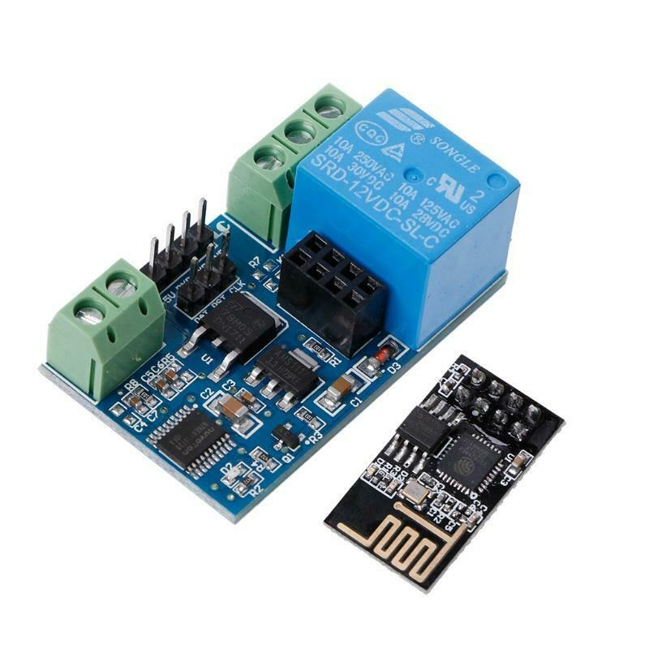
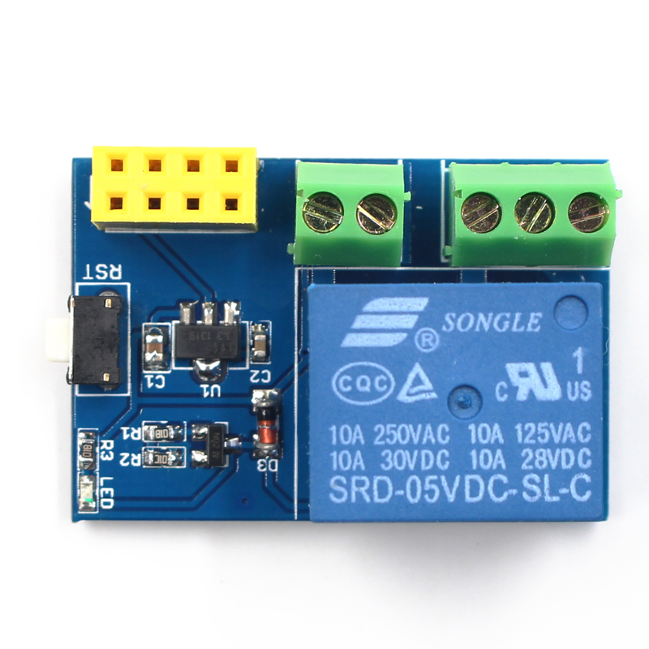

# ESP 8266 Alexa Enabled Relay

Creates a discoverable Philips Hue Device in Alexa using a ES8266 Chipset and relay.
Once discovered, Alexa can turn it on and off

## Python3 issue

- `env: python3: No such file or directory`

```
$ cd /Users/[your-username]/Library/Arduino15/packages/esp8266/tools/python3/3.7.2-post1/
$ rm python3
$ which python3
$ ln -s [path-returned-by-the-above-command] python3
```

## [Relay-A](relay-a/)



## [Relay-B](relay-b/)




